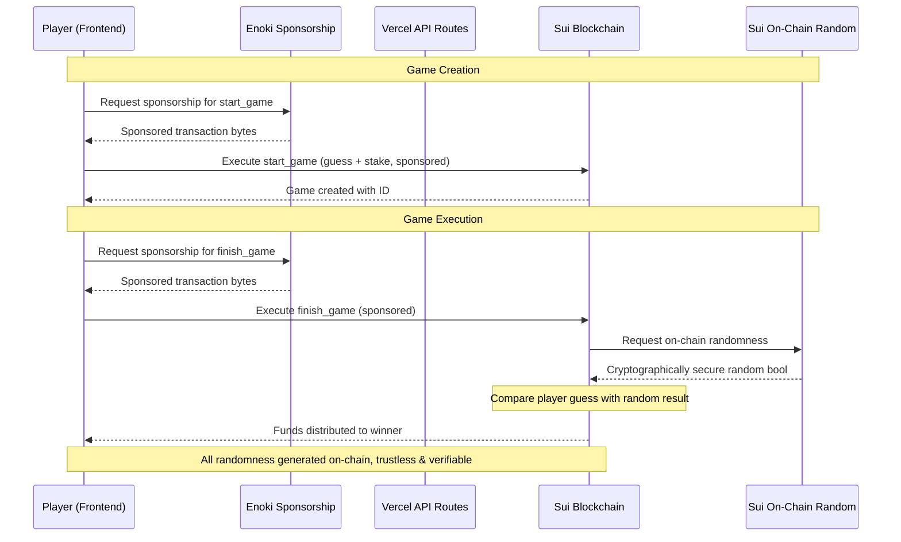

# Satoshi Coin Flip [v2] - On-Chain Randomness Edition

A fair 50/50 coin flip game built on Sui blockchain, utilizing Sui's native on-chain randomness for secure and trustless gameplay. Players bet on Heads or Tails with provably fair outcomes, powered by Move smart contracts and a React frontend with integrated Enoki sponsorship.

## What's New in V2

V2 introduces significant architectural improvements:

- **Sui On-Chain Randomness**: Uses Sui's built-in `random::Random` module for secure, trustless random number generation - eliminating the need for external VRF services
- **Enoki Sponsorship Integration**: Implements [@mysten/enoki](https://www.npmjs.com/package/@mysten/enoki) for gas-free transactions via Vercel API routes
- **Type-Safe Contract Bindings**: Auto-generated TypeScript bindings using [@mysten/codegen](https://www.npmjs.com/package/@mysten/codegen) for type-safe smart contract interactions
- **Simplified Architecture**: Single-transaction game flow with no backend signing service required

## Satoshi Coin Flip Modules

### `house_data.move`

Creates a singleton house data object that manages the game's treasury and configuration.

- Initializes house balance and game parameters (min/max stake, fees)
- Operates as the house's treasury, holding staking balance and collected fees
- Provides methods for house administration (top-up, withdraw, update parameters)

### `single_player_satoshi.move`

Defines the core game logic for a single-player coin flip game.

- **`start_game()`**: Creates a new game with player's guess (H/T) and stake
- **`finish_game()`**: Determines winner using Sui's on-chain randomness and distributes funds
- **`dispute_and_win()`**: Allows players to reclaim funds if game is not finished within `EPOCHS_CANCEL_AFTER` (7 epochs)

Key features:
- Uses dynamic object fields to store games within `HouseData`
- Implements fee collection on winning games
- Emits events for game creation (`NewGame`) and completion (`Outcome`)

### `mev_attack_resistant_single_player_satoshi.move`

**Note**: This module is **no longer necessary** with on-chain randomness. It was designed to prevent MEV attacks when using backend VRF services. With Sui's native randomness, the standard `single_player_satoshi` module provides equivalent security with better UX.

## Architecture

### V2 Flow (On-Chain Randomness)



### Comparison: V1 vs V2

| Feature | V1 (Backend VRF) | V2 (On-Chain Randomness) |
|---------|------------------|--------------------------|
| **Randomness Source** | Backend BLS signature | Sui on-chain `random::Random` |
| **Backend Service** | Required (signing service) | Optional (only for sponsorship) |
| **Transactions per Game** | 2 (create + finish) | 2 (create + finish) |
| **Trust Model** | Trust backend with house key | Trustless, cryptographically secure |
| **MEV Resistance** | Required 2-step flow | Built-in via on-chain randomness |
| **Gas Fees** | Player pays | Sponsored by Enoki |

## Quickstart

### Prerequisites
- Node.js 18+ and pnpm installed
- Sui CLI installed and configured
- Enoki API key (for sponsorship)

### Setup

1. **Navigate to setup directory**:
   ```bash
   cd setup/
   npm i
   ```

2. **Configure environment variables** based on `setup/README.md`:
   - `ADMIN_SECRET_KEY`: Admin wallet private key
   - `NETWORK`: Sui network (testnet/mainnet)
   - Other configuration per setup README

3. **Publish contracts and initialize house**:
   ```bash
   ./publish.sh testnet
   npm run init-house  # Requires admin account to have 10+ SUI
   ```

4. **Setup frontend**:
   ```bash
   cd ../app/
   pnpm i
   pnpm codegen  # Generate TypeScript bindings
   pnpm run dev
   ```

### Environment Variables (Frontend)

Create `app/.env.local` with:
```bash
VITE_ENOKI_PUBLIC_KEY=your_enoki_public_key
VITE_ENOKI_PRIVATE_KEY=your_enoki_private_key
VITE_NETWORK=testnet
VITE_PACKAGE_ID=<published_package_id>
VITE_HOUSE_DATA_ID=<house_data_object_id>
```

## Gameplay

1. **Connect Wallet**: Player connects their Sui-compatible wallet
2. **Place Bet**:
   - Choose Heads (H) or Tails (T)
   - Submit stake (between `min_stake` and `max_stake`)
   - Transaction is sponsored by Enoki (gas-free)
3. **Finish Game**:
   - Player (or anyone) calls `finish_game`
   - On-chain randomness determines outcome
   - Winner receives stake (minus fees if applicable)
4. **Dispute** (Optional):
   - If game is not finished within 7 epochs, player can call `dispute_and_win` to reclaim full stake

### Fairness Guarantees

With on-chain randomness, fairness is cryptographically guaranteed:

1. **Unpredictable Randomness**: The random value is generated by Sui's secure randomness beacon, which cannot be predicted or manipulated
2. **Transparent Verification**: All randomness generation happens on-chain and is verifiable in the transaction effects
3. **Time-Lock Protection**: Games that aren't finished within 7 epochs can be disputed, ensuring funds aren't locked indefinitely
4. **No Trust Required**: Unlike V1, no backend service holds cryptographic keys or can influence outcomes

## Project Structure

```
.
├── satoshi_flip/              # Move smart contracts
│   ├── sources/
│   │   ├── house_data.move
│   │   ├── single_player_satoshi.move
│   │   └── mev_attack_resistant_single_player_satoshi.move (legacy)
│   └── tests/
├── app/                       # Frontend application
│   ├── src/
│   │   ├── __generated__/     # Auto-generated contract bindings (@mysten/codegen)
│   │   ├── components/
│   │   ├── hooks/
│   │   ├── services/
│   │   └── pages/
│   └── api/                   # Vercel API routes for Enoki sponsorship
│       ├── sponsor/
│       │   ├── prepare.ts     # Prepare sponsored transaction
│       │   └── execute.ts     # Execute sponsored transaction
│       └── lib/
│           ├── enokiClient.ts
│           └── config.ts
└── setup/                     # Deployment scripts
    └── publish.sh
```

## Technical Details

### On-Chain Randomness Implementation

From `single_player_satoshi.move:108-114`:

```move
// Step 1: Generate secure randomness using Sui's native random.
let mut generator = random::new_generator(random_state, ctx);
let random_result = random::generate_bool(&mut generator);

// Step 2: Determine winner.
let player_guess_bool = map_guess(guess) == 0; // H = 0 = false, T = 1 = true
let player_won = player_guess_bool == random_result;
```

The `random::Random` shared object provides cryptographically secure randomness through Sui's randomness beacon, eliminating the need for external VRF services.

### Enoki Sponsorship

Transaction sponsorship is handled via Vercel API routes:

- **`/api/sponsor/prepare`**: Prepares a sponsored transaction with allowed move call targets
- **`/api/sponsor/execute`**: Executes the sponsored transaction on behalf of the player

Sponsored move calls include:
- `single_player_satoshi::start_game`
- `single_player_satoshi::finish_game`
- Standard coin operations (`split`, `join`, `transfer`)

### TypeScript Bindings

Generated using `@mysten/codegen`:

```bash
pnpm codegen  # Reads sui-codegen.config.ts and generates TypeScript types
```

This creates type-safe functions for all Move contract interactions in `src/__generated__/`.

## Security Considerations

### On-Chain Randomness Benefits

- **No Key Management**: No backend private keys to secure
- **No MEV Risk**: Randomness is generated after the guess is committed on-chain
- **Verifiable**: All randomness sources are recorded in transaction effects
- **Censorship Resistant**: No backend can refuse to sign or delay transactions

### Known Limitations

- **Epoch Delay**: On-chain randomness requires a small delay (typically sub-second) for generation
- **Gas Costs**: While sponsored by Enoki, on-chain randomness does add computational cost
- **Dispute Window**: 7-epoch window for disputes means funds can be locked briefly

## Migration from V1

If you're migrating from V1 (backend VRF):

1. **Remove Backend Service**: No signing service needed
2. **Update Contract Calls**: Replace VRF-based `finish_game` with randomness-based version
3. **Remove Counter NFT**: No longer needed for VRF input
4. **Simplify Flow**: Use single-transaction `single_player_satoshi` module instead of MEV-resistant variant

## Disclaimer

"Satoshi Coin Flip" is intended to serve as a general reference and is provided for informational purposes only. It does not provide gambling endorsement, advice, or recommendations. Users are responsible for their own gambling activities and decisions, including complying with applicable laws and regulations relating to gambling. We make no representations or warranties of any kind, express or implied, about the completeness, accuracy, reliability, suitability, or availability of the information provided. We are not responsible for any legal consequences users may face.

## License

Released under the [Apache 2.0 License](LICENSE).

## Acknowledgments

- Original theory presented by Kostas Chalkias at [GAM3R 2022](https://docs.google.com/presentation/d/1a9wddWhqKM4GXMV1UrhrpaH1sBMUxZWI/edit?usp=sharing&ouid=110032463750803153525&rtpof=true&sd=true)
- Built with [@mysten/sui](https://www.npmjs.com/package/@mysten/sui), [@mysten/dapp-kit](https://www.npmjs.com/package/@mysten/dapp-kit), and [@mysten/enoki](https://www.npmjs.com/package/@mysten/enoki)